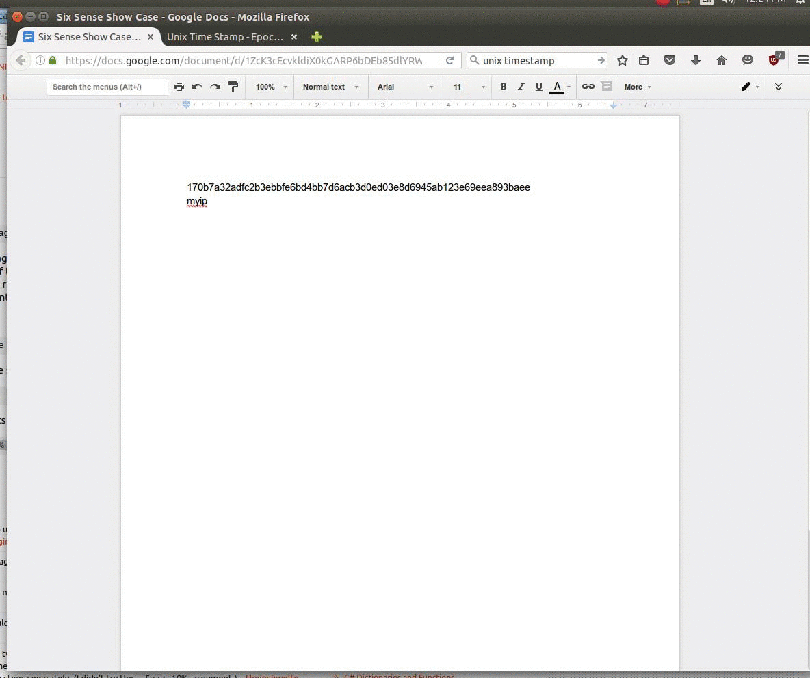

## Sixense - Sixth Sense
Right click the mouse (or ctrl + c), copy the text.
Let sixense work for you.



### Installation

```bash
make install
```

### Usage

```bash
python bin/sixense
```

### Modules

1.  Translate English to Chinese. (Fixing)

2.  Find public IP address.

3.  Find URL title and check security risk with Google SafeBrowsing (WIP)

4.  Use Virus Total api to check if SHA-256 is potentially malicious (WIP)

5.  Convert UNIX timestamp.


